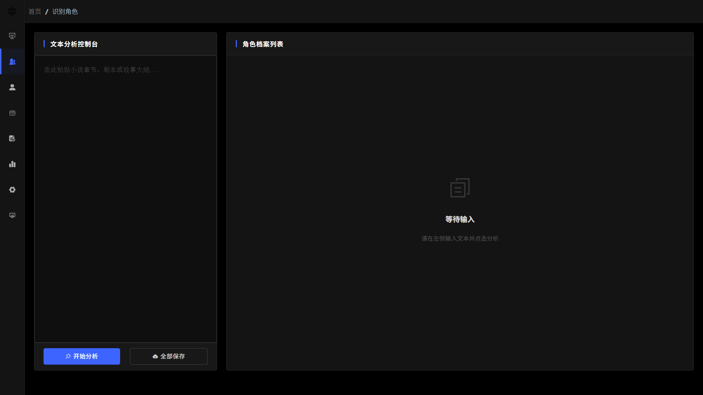
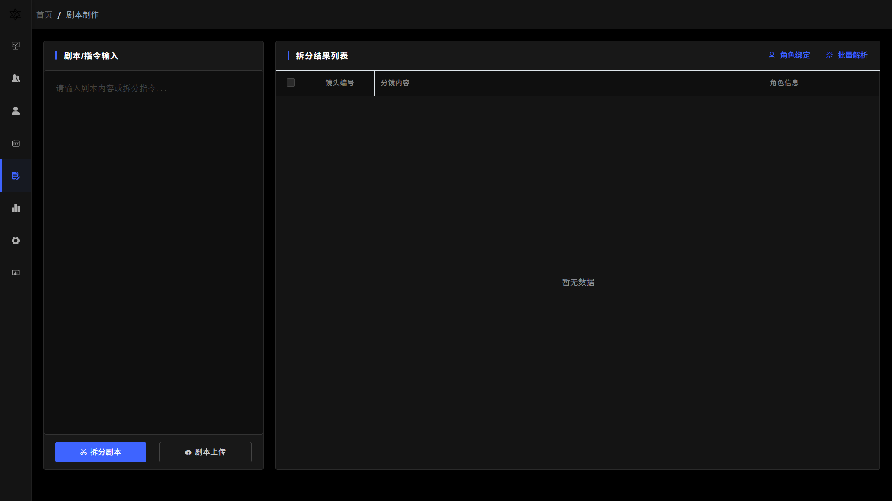
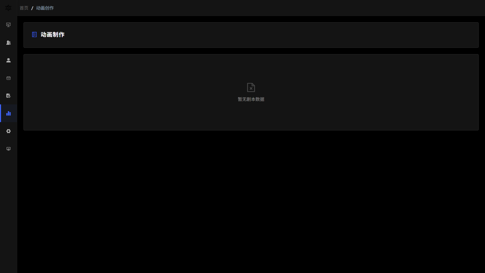
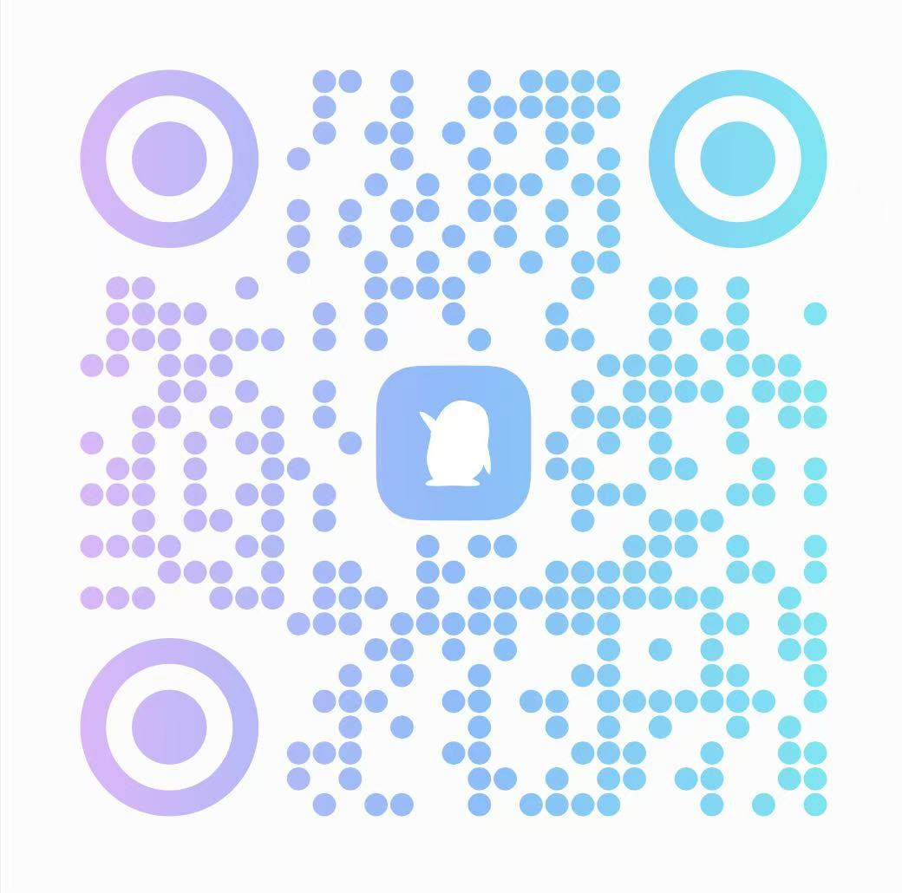

# SOLA AI  
### AI 动漫视频生成开源框架（可商用 · 支持二次开发）

SOLA AI 是一套面向创作者与技术团队的 **AI 动漫视频生成开源框架**，  
提供从 **角色生成、剧本拆分、镜头管理到视频生成** 的完整工程化能力。

框架以 **Java + Vue** 为核心，支持私有化部署与深度二次开发，  
适用于内容创作、工作室生产、企业级项目落地等场景。

---

## 项目简介

SOLA AI 关注的是 **“可落地的生产流程”**

你可以基于该框架，快速构建属于自己的：

- 动漫剧情生成系统  
- AI 剧情号 / 动漫号生产后台  
- 企业内部视频自动化平台  
- 也可自用，降低市面上封装的api的算力乱象问题

项目整体设计偏工程化、可维护、可扩展。

---

## 核心功能

- 角色生成与管理  
- 剧本自动拆分为镜头  
- 镜头与角色自动绑定  
- 动漫视频任务生成与调度  
- 多 AI 接口统一封装与切换  
- 支持横版 / 竖版视频比例  

---

## 功能示例

### 角色生成
![角色生成示例]
![输入图片说明]

---

### 剧本与镜头拆分
![剧本拆分示例]

---

### 动漫视频生成
![视频生成示例]


感兴趣可以和我交流
V:

qq:

上述没加上，可加下个人V，会看时间同意:OvO--1016Y

---

## 软件架构

```text
前端：Vue + Element Plus  
后端：Java 8 / Spring Boot  
数据库：MySQL  
缓存：Redis  
任务调度：基于 Redis 的队列模型  
AI 能力：支持多平台 API 接入
